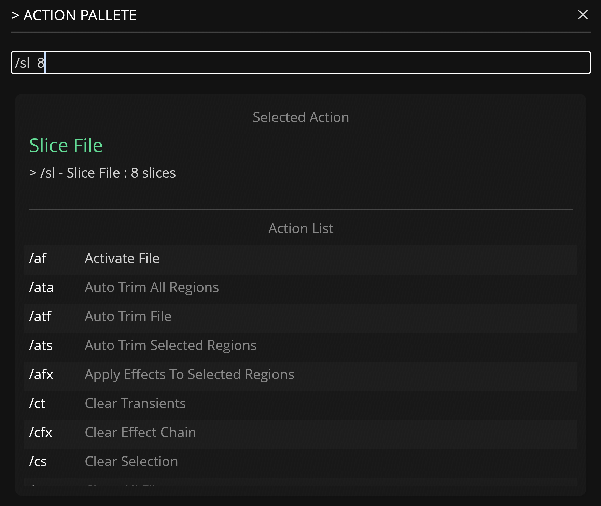

# Action Palette

---

The Action Palette provides a keyboard-centric workflow for triggering [Actions](actions.md) within Recorte using slash commands (for example, `/ats`).

To open the Action Palette, press the `c` key or run the `Open Action Pallete` action.

## Usage

You may type a slash command directly (for example, `/ata`) or search by typing any part of a command name or its description. The list uses fuzzy matching across both fields. The input field accepts commands with optional parameters, such as `/ata -10`.

### Navigating Suggestions

When suggestions are available:

* **Up / Down arrows** — Move through the filtered command list.
* **Tab** — Autocompletes the input to the first suggested command and populates its parameter placeholders.
* **Enter** — Selects the highlighted item and inserts its full slash command (with parameters) into the input field. Press Enter again, or click away to lose focus, to execute the command and close the modal.

### UI Components

* **Input Field**: Used to enter a slash command or action name. When a command is recognized, it displays below as the **Selected Action** with its current parameter values.

* **Action List**: A two-column table showing matched commands. The left column shows the slash command (for example, `/ats`). The right column shows its description. Use the up and down arrow keys to navigate and press Enter to select an item. Selecting an item updates the input field with the corresponding slash command.
