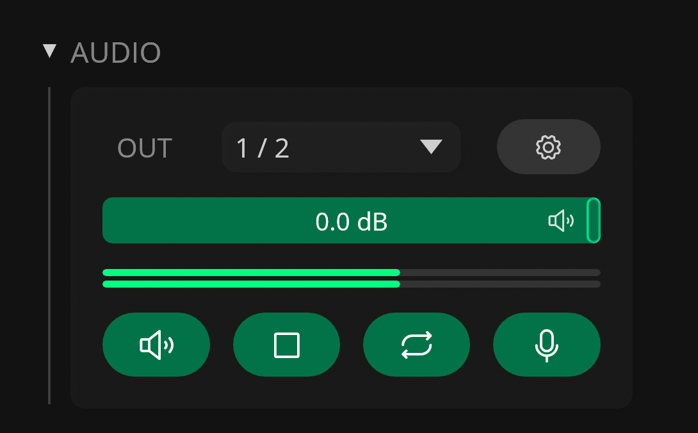

# Audio Playback

---

## Audio Processing in Recorte

Recorte uses a custom background and offline audio engine for playback, meaning files and regions are processed and rendered in a background thread and cached to reduce CPU usage and latency.

---

## Outputs

### Main Output

{  width="400", .float-right }

The Main output serves as the primary audio playback channel.

You can configure the output device, channel, sample rate, and buffer size via the [Audio tab in Settings](settings.md#audio).

### Sample Output

The Sampler output lets the user select a dedicated channel (in the same output device as Main) to use with [`Send to Sampler` action](actions.md) and it's designed to speed up the process of sending / playing files and regions to external hardware samplers.

---

## Audio Controls (Sidebar)

{  width="400", .float-right }

The Audio section in the Sidebar contains different parameters that can be used to control the audio playback in Recorte, including:

- Drop-down menu for Main output channel
- :phosphor-gear:: Button to open the Audio settings
- Volume slider for the Main output
- :phosphor-speaker-high:: Button to enable / disable audio output
- :phosphor-stop:: Button to stop playback (panic)
- :phosphor-arrows-clockwise:: Button to enable / disable looping
- :phosphor-microphone:: Button to enable / disable audio input
