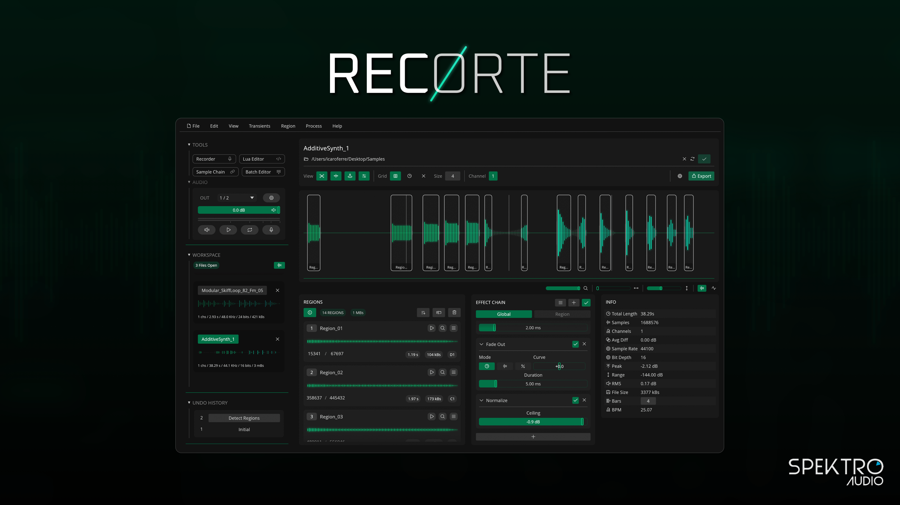

# Recorte

## About Recorte

Recorte is a standalone audio editor designed for sample creation. 

It includes features specifically built for recording, editing, processing and exporting samples, such as: an advanced audio recorder with multiple recording modes and options, automatic region detection, transient and grid-based slicing, batch region renaming, 25+ built-in effects with global and per-region effect chains, MIDI playback, and additional tools like the sample chain generator, a batch editor, and integrated Lua scripting.

You can use it during pre-production to record, slice, process and trim audio files, sample MIDI instruments, extract loops, and prepare files to be used in your favorite hardware sampler or DAW.

Built for efficiency and ease of use, the app is optimized for a fast, lightweight experience, with low resource usage, a smooth and responsive UI, and multiple ways to interact with its features.

You can also customize to your own workflow with macro-style keyboard shortcuts, 15+ built-in themes with a theme editor, default settings, JSON-based presets, and more.

Recorte is available for macOS (Silicon & Intel), Windows (x64) and Linux.

**Product Page:** [https://spektroaudio.com/recorte](https://spektroaudio.com/recorte)

**Current Version:** 1.0

