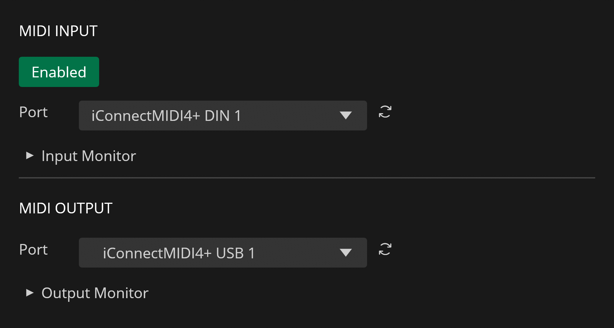

# MIDI

---

Recorte includes MIDI input and output support that can be set up via [Settings](settings.md#midi).

## MIDI Input

Recorte supports MIDI input from the selected MIDI Input port (in Setting's MIDI tab), allowing received MIDI notes to play the active file similarly to a sampler.

Upon receiving a MIDI note, Recorte uses the incoming pitch and velocity to control playback rate (pitch) and volume, generating [PlayMIDI actions](actions.md) based on these rules:

- **Selection:** Plays the selected range, transposed via MIDI.
- **Region Selected:** Only plays the selected region, transposed according to the MIDI note.
- **Regions Present (None Selected):** Regions are mapped across MIDI notes starting at C3, with each note triggering a different region.
- **No Regions in Active File:** Plays entire file.
- **No Active File:** No action occurs.

## MIDI Output

The MIDI output port can also be selected from the Setting's MIDI tab and it's used to send MIDI notes when recording audio with the [**MIDI** Recording Mode](tools/audiorecorder.md#recording-modes).
