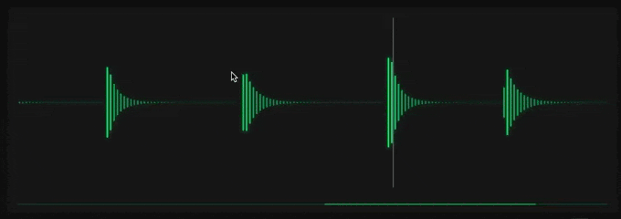
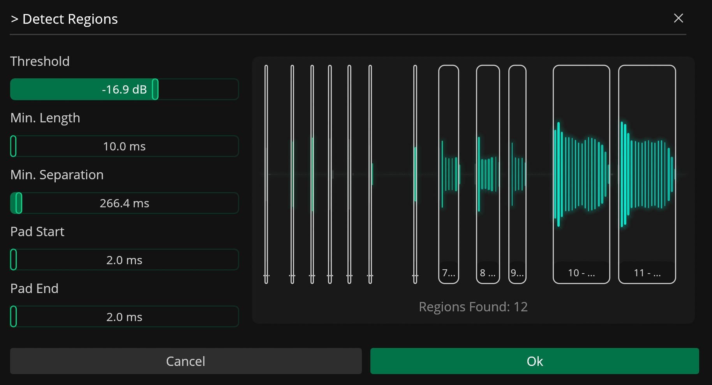
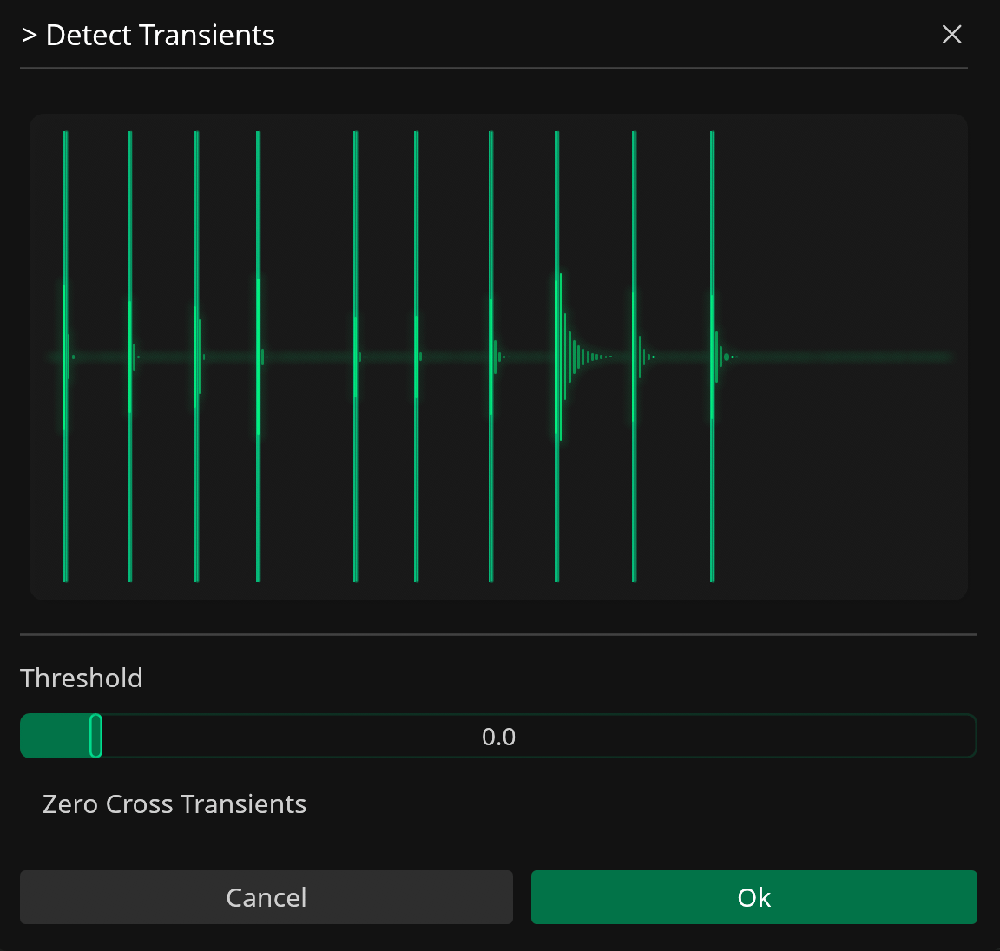
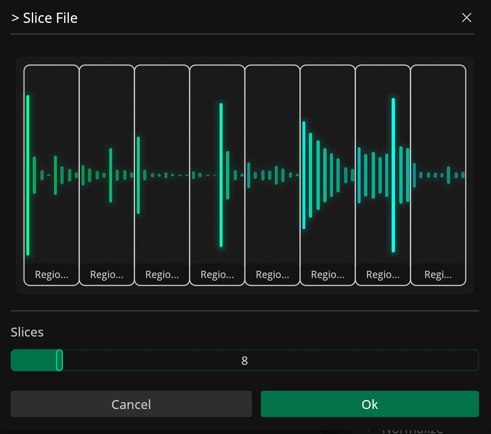
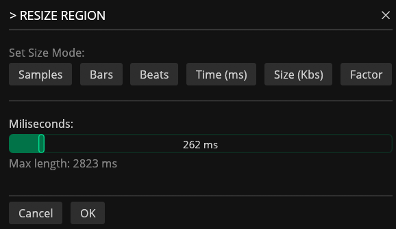
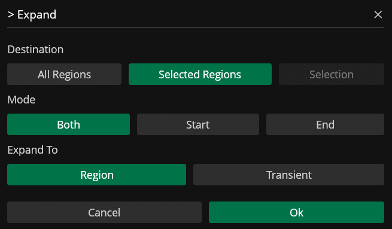
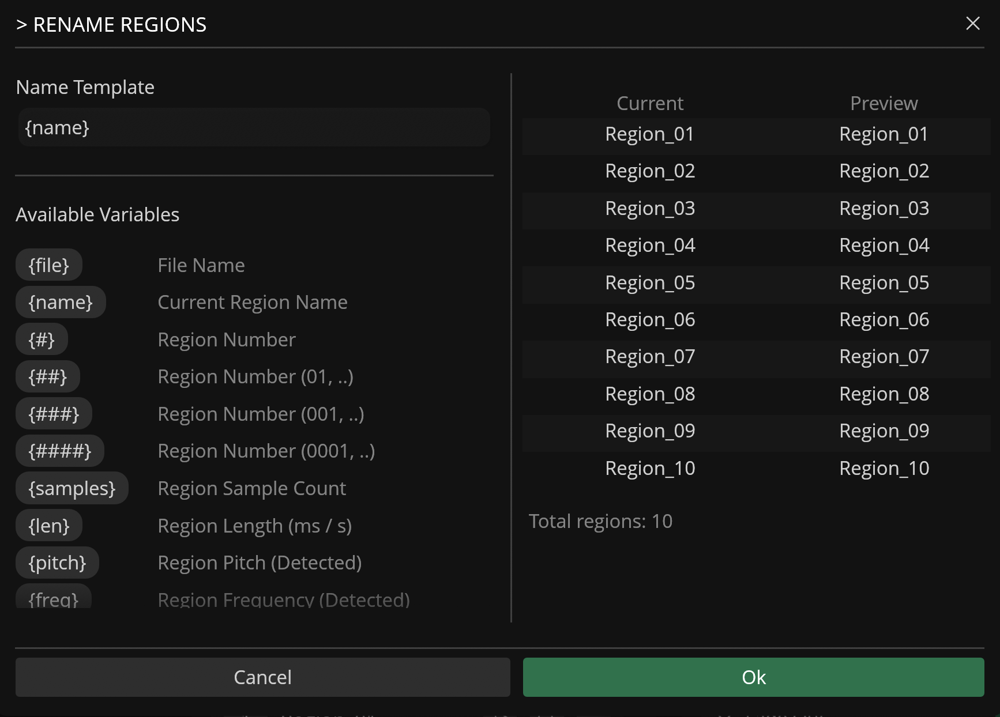
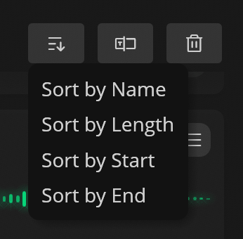

# Regions

---

Regions are sections of a file that can be processed and exported independently, and defined by a name, start / end sample positions, and a list of (local) effects.

Local effects are applied only to the specific region they belong to and do not affect other regions or the global project settings. Each region can be processed with its own set of parameters for targeted audio manipulation within the file.

## Creating Regions

Regions can be created in different ways:

### Mouse Selection

To manually create a region, click and drag on the file waveform to make a selection. Then click on the selection to create a new region.

### Detect Regions 

The region detector in Recorte automatically identifies relevant regions in the file based on audio gain levels.

| Parameter       | Description                                                           |
|-----------------|-----------------------------------------------------------------------|
| Threshold       | Threshold for detection                                       |
| Min. Length     | Minimum length for each detected region in milliseconds       |
| Min. Separation | Minimum separation (in milliseconds) between detected regions |
| Pad Start       | Start padding in milliseconds                                 |
| Pad End       | End padding in milliseconds                                   |

### Detect Transients + Create Regions from Transients 

{width="400"}

To create regions based on transients:

1. Use the `Detect Transients` action to detect all transients in the file.

2. Use the `Create Regions from Transients` to automatically create regions between all transients found.

### Slice

{width="400"}

To slice the file into a specified number of regions of equal length, use the `Slice File` action.

Regions can also be sub-divided through the `Slice Region` action.

### Lua Scripting

You can create regions with custom scripts in the integrated Lua Editor.

## Editing Regions

Recorte also includes different methods to edit a region after it is created.

### Manual Editing

You can adjust the start and end points of a region. Click and drag either end in the waveform, or use the start and end numbers in the Regions list.

### Region Resize

{width="400"}

Regions can also be resized using the [`Resize Region` action](actions.md#resize-region). This lets you adjust the region length based on samples, bars, beats, time (ms), size (kB), or factor.

### Expand

{width="400"}

The [`Expand` action](actions.md#expand) lets you expand the start and end of regions to their neighboring regions, closest transients, or file boundaries.

It can also be used to expand the current selection in the waveform display.

### Slice Region

Regions can also be sub-divided into equal parts through the [`Slice Selected Region` action](actions.md/#slice-selected-region).

## Pitch Detection

Recorte can detect the musical pitch of each region, with best results on monophonic audio. The result is shown as a badge in the [Regions list](userinterface.md#regions-list) when Region Info is enabled, and can be used as the `{pitch}` variable in [naming templates](#renaming-variables). When the [Detect Region Pitch](settings.md#general) setting is enabled (default), pitch is detected automatically after regions are created or adjusted; you can also run it manually with the [`Detect Pitch for All Regions` action](actions.md#detect-pitch-for-all-regions).

| Detection   | Description                                                                                                          |
|-------------|----------------------------------------------------------------------------------------------------------------------|
| Single note | A sustained pitch, shown as note name + octave (e.g. `A3`). If it deviates more than 0.1 semitones from the nearest note, the deviation is also shown (e.g. `A3 0.4`) |
| Note sequence | 2–4 distinct notes in a region of up to 10 seconds, shown in order (e.g. `C4-Eb4`)                               |
| Not detected | Silent or non-tonal audio — no badge is shown                                                                        |

## Renaming Regions

Regions can be renamed individually by clicking on the region name in the Region list or in batch using the `Rename Regions` function (:phosphor-textbox:).

{width="600"}

The `Rename Regions` feature lets you rename all regions in a file based on a naming template and any of the different variables available (such as the region number, length, sample count, sample rate, etc).

Variables used in the Name Template are automatically converted to their appropriate values during renaming.

### Renaming Variables

| Variable | Description |
|----------|-------------|
| `{name}` | File Name |
| `{region}` | Current Region Name |
| `{#}` | Region Number |
| `##` | Region Number (01..) |
| `###` | Region Number (001..) |
| `####` | Region Number (0001..) |
| `{samples}` | Region Sample Count |
| `{len}` | Region Length (ms) |
| `{pitch}` | Region Pitch (Detected) |
| `{freq}` | File BPM (Detected) |
| `{sr}` | Sample Rate |
| `{bit}` | Bit Depth |
| `{ch}` | Channels Count |

## Sorting Regions

{width="200", .float-right}

Sort regions by name, length, start, or end point using the Sort button (:phosphor-sort-ascending:) in the Region list header.

## Exporting Regions

Regions can be exported as new files within Recorte or as audio files to your computer.

To export an individual region, click on the Export icon (:phosphor-export:) in the region and select one of the options available.

To export all regions in a file as new files, use the `New Files from Regions` function available in the File sub-menu.

To export all regions in a file as audio files, use the `Export All Regions` available in the Export button or in File / Export sub-menu.

## Removing Regions

To remove a region, click on the list icon (:phosphor-list:) on the region's header and select the `Remove Region` option.

To remove the selected or all regions, click on the Trash icon in the Regions list to open the drop-down menu and select one of the available options.

