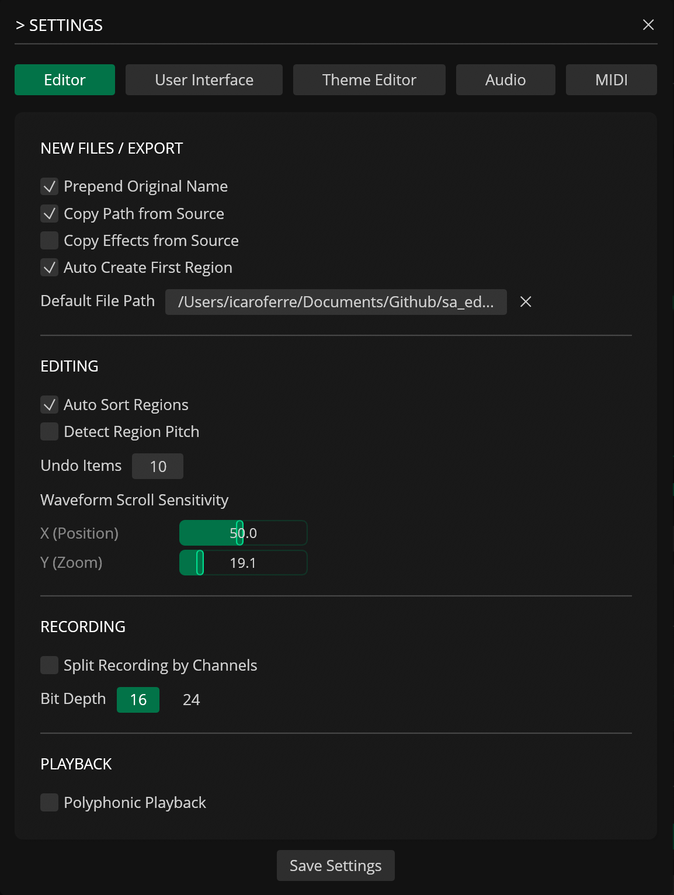
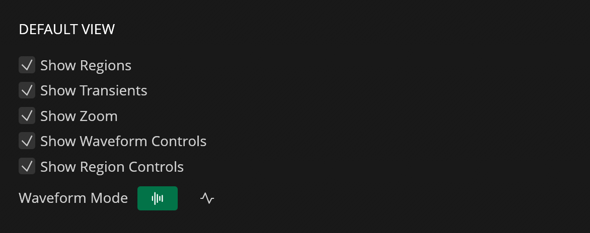
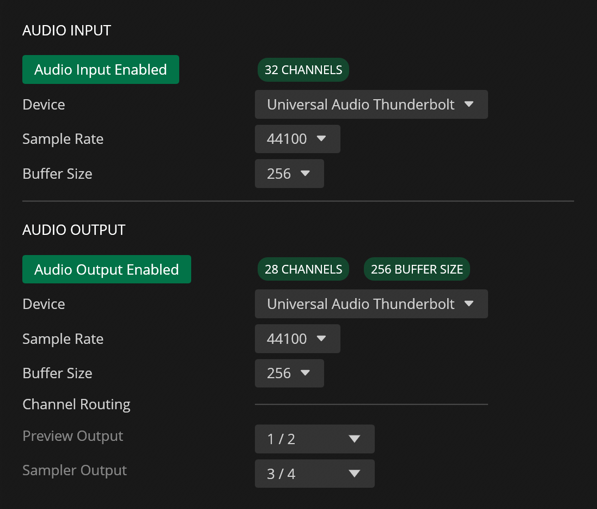

# Settings

---

## General

| Name                        | Description                                                                           |
|-----------------------------|---------------------------------------------------------------------------------------|
| Prepend Original Name       | Prepend the original file name to the new file name when creating or exporting a file |
| Copy Path from Source       | Keep the original file's path when creating or exporting a new file                   |
| Copy Effects from Source    | Copy modifiers (metadata/attributes/tags) from the original file into the new file    |
| Auto Create First Region    | Automatically create an initial region when you create or open a new file             |
| Auto Sort Regions           | Automatically sort regions in the editor by start sample                              |
| Default File Path           | Set the default path for new audio recordings                                         |
| **EDITING**                 |                                                                                       |
| Detect Region Pitch         | Automatically detect the pitch of newly created or edited regions                     |
| Undo Items                  | Set the maximum undo items per file (5-100)                                           |
| Waveform Scroll Sensitivity | Set the mouse scroll sensitivity (horizontal = X, vertical = Y)                       |
| X (Position)                | Horizontal mouse scroll sensitivity                                           |
| Y (Zoom)                    | Vertical mouse scroll sensitivity                                             |
| **RECORDING**               |                                                                                       |
| Split Recording by Channels | Split each input channel into separate tracks/regions when recording                  |
| Bit Depth                   | Set the recording bit depth (16-bit or 24-bit)                                        |
| **PLAYBACK**                |                                                                                       |
| Polyphonic Playback         | Allow overlapping playback of multiple regions/voices (polyphonic playback)           |

## User Interface

| Name                   | Description                                                                     |
|------------------------|----------------------------------------------------------------------------------|
| Show Regions           | Default: show region in waveform view                                            |
| Show Transients        | Default: show transient markers in waveform view                                 |
| Show Zoom              | Default: show zoom controls in the waveform view                                 |
| Show Waveform Controls | Default: show waveform control elements (play/pause/other controls)              |
| Show Region Controls   | Default: show region control elements (play/pause/other controls) in the Regions panel |
| Waveform Mode          | Choose waveform display mode (Bars or Line)                                      |

## Theme Editor

| Name         | Description                                                                                               |
|--------------|-----------------------------------------------------------------------------------------------------------|
| Theme Editor | Open the theme editor UI to edit colors and other theme values (availability depends on licensing/limits) |
| Load Theme   | Load/import a theme JSON from the themes directory into the theme editor                                  |
| Export Theme | Export the currently edited/applied theme to a JSON file                                                  |

## Audio

| Name                            | Description                                                                         |
|---------------------------------|-------------------------------------------------------------------------------------|
| **AUDIO INPUT**                 |                                                                                     |
| Audio Input Enabled / Disabled  | Enable or disable audio input                                                       |
| Device                          | Select the audio input device to use                                                |
| Sample Rate                     | Select the sample rate for the selected input device (choose from available rates)  |
| **AUDIO OUTPUT**                |                                                                                     |
| Audio Output Enabled / Disabled | Enable or disable audio output                                                      |
| Device                          | Select the audio output device to use                                               |
| Sample Rate                     | Select the sample rate for the selected output device (choose from available rates) |
| **CHANNEL ROUTING**             |                                                                                     |
| Preview Output                  | Set the output device channel for audio playback or preview (main output)           |
| Sampler Output                  | Set the output device channel for the `Send to Sampler` action                      |

## MIDI

| Name                     | Description                                                       |
|--------------------------|-------------------------------------------------------------------|
| **MIDI INPUT**           |                                                                   |
| Enabled / Disabled       | Enable or disable MIDI input processing                           |
| Port                     | Select the MIDI input port from detected MIDI devices             |
| MIDI Monitor             | Show incoming MIDI events for monitoring and debugging            |
| **MIDI OUTPUT**          |                                                                   |
| Port                     | Select the MIDI output port used for sending MIDI messages        |
