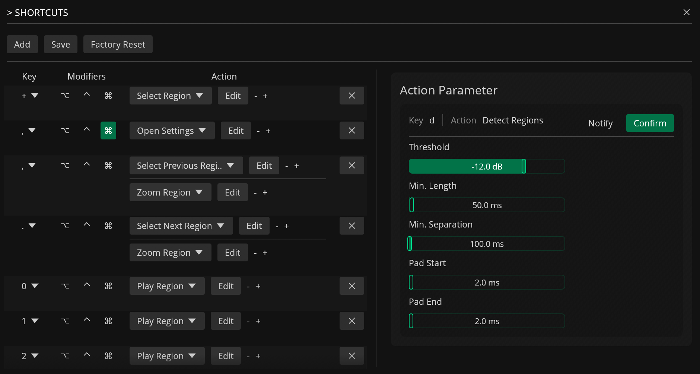

# Keyboard Shortcuts

---

## About

Shortcuts in Recorte provide a flexible and powerful method for triggering one or more [Actions](actions.md) through the keyboard using a macro-style approach.

Rather than mapping keyboard keys to individual actions, each key can be customized to trigger multiple actions sequentially. Parameters for each action can also be customized, and confirmation dialogs or notifications can be enabled.

This approach allows for multiple shortcuts to be assigned to the same action using different parameters.

## Shortcuts Editor

The Shortcuts Editor can be used to customize keyboard shortcuts by mapping keys to one or more actions. It can be accessed from the Settings menu to modify existing shortcuts or create new ones.

### Editor Interface

The shortcuts table displays all configured shortcuts with the following columns:

- **Key**: Displays the character key bound to the shortcut. The dropdown can be clicked to change the key. For example, `'z'` for Zoom, `'c'` for Action Palette.
- **Modifiers**: Toggle buttons for Option, Control, and Command modifiers. For instance, Control+`'c'` copies the selection.
- **Actions**: Shows the action(s) triggered by the shortcut. The dropdown can be clicked to select from available actions (only actions that can be mapped to shortcuts are shown). The `+` button can be used to add more actions to the same shortcut.
- **Edit**: Opens the parameter pane for the selected action, where parameters can be customized.

### Parameters Pane

When the `Edit` button is clicked for an action, a parameters pane appears on the right side of the editor. This pane allows parameters to be customized for that specific action. For example, when the `'t'` shortcut for Auto Trim is edited, the threshold value can be adjusted in decibels.

### Confirmation Dialogs

Confirmation dialogs can be triggered for some shortcuts to prevent accidental actions. The following factory shortcuts are configured with confirmation:

- `'a'` → Apply Effects to Selected Regions
- `'A'` → Apply Effects to All Regions
- Control+`'a'` → Apply Effects to Selection

When triggered, a confirmation dialog will appear asking for confirmation before the action executes.

### Modifier Keys

Keys can be combined with modifiers for more powerful shortcuts.

Available modifiers:

- **Command (:phosphor-command: )** 
- **Control (:phosphor-control:)**
- **Option (:phosphor-option:)**

### Multiple Actions per Shortcut

A single key can trigger multiple actions in sequence. For example, the comma key (`,`) is configured to both select the previous region and zoom to it. This macro-style approach allows related actions to be chained together for efficient workflows.

## Factory Shortcuts

The following tables list all factory shortcuts included with Recorte, organized by category. See [Actions](actions.md) for a description of each action.

### File

| Modifiers | Shortcut | Action(s) | Information |
|-----------|----------|-----------|-------------|
| Command | `o` | Open File | |
| — | `n` | New File | |
| Command | `w` | Close Active File | Confirmation dialog |
| — | `s` | Slice File | 8 slices; confirmation dialog |

### Playback

| Modifiers | Shortcut | Action(s) | Information |
|-----------|----------|-----------|-------------|
| — | `1`–`9`, `0` | Play Region | `1`–`9` play regions 1–9; `0` plays region 10 |
| — | `l` | Toggle Playback Loop | |

### Editing

| Modifiers | Shortcut | Action(s) | Information |
|-----------|----------|-----------|-------------|
| Command | `c` | Copy Selection | |
| Command | `v` | Paste | Position: 0%; Mode: Add |
| Command | `z` | Undo | |
| Command | `Z` | Redo | |

### Region Actions

| Modifiers | Shortcut | Action(s) | Information |
|-----------|----------|-----------|-------------|
| — | `t` | Auto Trim Selected Region | Threshold: -24 dB |
| Command | `d` | Duplicate Selected Region | |
| — | `E` | Expand | Auto / Both / Region |
| Command | `E` | Expand | Auto / Both / Transient |
| — | `R` | Resize Region | |
| — | `+` | Select Region | Longest |
| — | `_` | Select Region | Shortest |
| — | `{` | Select Region | First |
| — | `}` | Select Region | Last |
| — | `[` | Move Regions | -10% |
| — | `]` | Move Regions | +10% |

### Transients & Detection

| Modifiers | Shortcut | Action(s) | Information |
|-----------|----------|-----------|-------------|
| — | `d` | Detect Regions | Threshold: -12 dB; zero-crossing enabled; confirmation dialog |

### Recording

| Modifiers | Shortcut | Action(s) | Information |
|-----------|----------|-----------|-------------|
| — | `i` | Set Recording Length → Start Recording | 5 seconds |
| — | `o` | Set Recording Length → Start Recording | 10 seconds |
| — | `u` | Set Recording Length → Start Recording | 1 second |

### Effects & Processing

| Modifiers | Shortcut | Action(s) | Information |
|-----------|----------|-----------|-------------|
| — | `a` | Apply Effects to Selected Regions | Confirmation dialog |
| — | `A` | Apply Effects to All Regions | Confirmation dialog |
| Control | `a` | Apply Effects to Selection | Confirmation dialog |
| — | `S` | Send to Sampler | Source: File; Gain: -6 dB; Channel: 1; confirmation dialog |

### Selection

| Modifiers | Shortcut | Action(s) | Information |
|-----------|----------|-----------|-------------|
| — | `m` | Mark Selection | |

### UI & Navigation

| Modifiers | Shortcut | Action(s) | Information |
|-----------|----------|-----------|-------------|
| — | `,` | Select Previous Region → Zoom Region | |
| — | `.` | Select Next Region → Zoom Region | |
| — | `z` | Zoom | Destination: Auto |
| — | `Z` | Zoom All | |
| — | `C` | Center to Selected Region | |
| — | `w` | Toggle Waveform Mode | |

### Tools & Windows

| Modifiers | Shortcut | Action(s) | Information |
|-----------|----------|-----------|-------------|
| — | `c` | Open Action Palette | |
| — | `r` | Open Audio Recorder | |
| — | `L` | Open Lua Editor | |
| — | `e` | Open Export Settings | |
| Command | `,` | Open Settings | |

## Factory Reset

To reset all shortcuts to factory defaults, open the Shortcuts settings and click on the `Factory Reset` button.

## Shortcuts File

To make it easier to share or edit shortcuts externally, Recorte saves all shortcuts as a `.json` file in `%APP_FOLDER%/settings/shortcuts.json`. The app reloads the file automatically when you re-open it.
