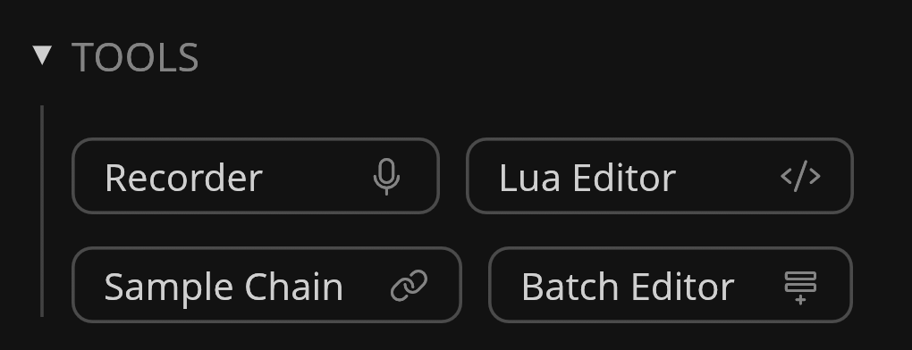

# Tools

---

Tools in Recorte add more ways of creating and editing files based on different features and workflows that go beyond the features avaialble in the core editor.

## Available Tools

- [Audio Recorder](tools/audiorecorder.md)
- [Lua Editor](tools/luaeditor.md)
- [Sample Chain](tools/samplechain.md)
- [Batch Editor](tools/batcheditor.md)
