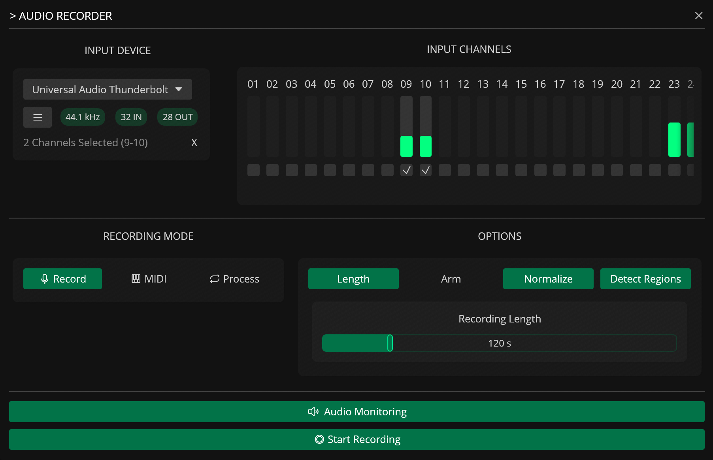
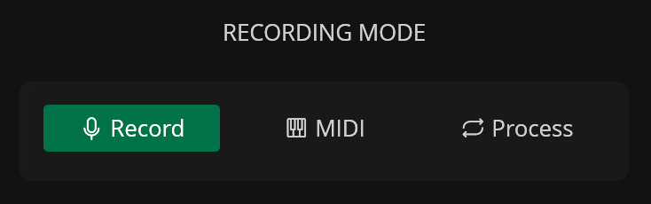
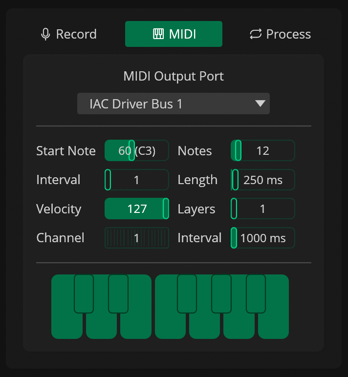
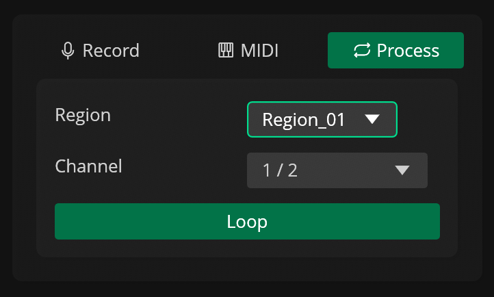
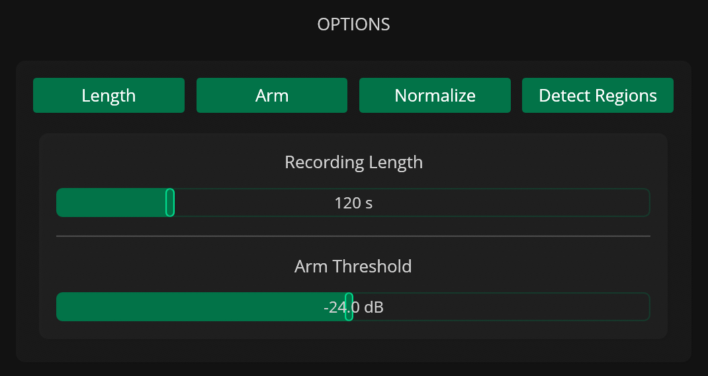

# Audio Recorder

---

The Audio Recorder captures audio from external hardware, software instruments, or internal routing to create new samples. It features three recording modes for different tasks (standard manual recording, automated MIDI sampling, and external signal processing), multi-channel input selection, and real-time monitoring.

### Recording Modes

#### Record

**Record** is the standard mode that simply records incoming audio from the selected inputs.

#### MIDI

{width="300", .float-right}

**MIDI** mode samples MIDI-enabled instruments and devices automatically. It sends MIDI notes to the selected MIDI port using a predefined range that you set.

| Parameter  | Description                              |
|------------|------------------------------------------|
| Start Note | First MIDI note                          |
| Notes      | Number of notes to play                  |
| Step Size  | Interval step size in semitones          |
| Length     | Length of each MIDI note in milliseconds |
| Velocity   | Base MIDI velocity                       |
| Layers     | Number of velocity layers                |
| Channel    | MIDI Channel                             |
| Interval   | Interval between notes in milliseconds   |

#### Process

{width="300", .float-right}

**Process** helps you process samples with external audio effects, such as hardware compressors or delays. It plays a region, a selection, or the entire active file through a different audio output channel of the selected audio output device. The output of the external effect can then be routed to one of the channels on the active audio input device and recorded as a new sample.

| Parameter   | Description                                                                  |
|-------------|------------------------------------------------------------------------------|
| Source      | Audio source to to be played externally (File / Selection / Selected Region) |
| Out Gain    | Output gain in decibels                                                      |
| Out Channel | Audio output device channel                                                  |
| Loop        | Toggle looping playback for the selected region                              |

### Options

The Audio Recorder also includes additional options that can be used to improve the recording workflow.

| Option         | Description                                            |
|----------------|--------------------------------------------------------|
| Length         | Limit the recording to a specified length in seconds   |
| Arm            | Toggle arm recording (wait for signal above threshold) |
| Normalize      | Normalize the recording                                |
| Detect Regions | Automatically detects regions in the recording         |

### Input Monitoring

Input monitoring can be enabled through the `Audio Monitoring` button.

### Presets

Presets for the Audio Recorder can be saved and loaded through the list (:phosphor-list:) button in the Input Device section.

Each preset stores the selected audio input device, channels, recording mode, monitoring state and options.

!!! warning
    Enabled channels may not load correctly if the audio input device included in a preset is not available when the preset is loaded.

