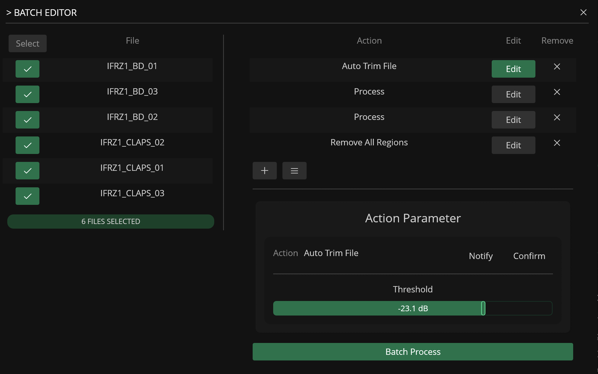

# Batch Editor

---

The Batch Editor tool makes it easier to process and export multiple files open in the Workspace at once using a customizable [action](../actions.md) list.

[Actions](../actions.md) can be added to list via the add (:phosphor-plus:) button and the parameters for each action can be edited by clicking on the Edit button.

!!! warning
    The list of available actions in the Batch Editor only include actions compatible with batch-procesing.

## Presets

Presets for the Batch Editor can be saved and loaded via the list (:phosphor-list:) button. 

Presets store the entire sequence of actions and their specific parameter configurations, allowing you to quickly recall complex processing chains for different projects.  
For example, you might create a "Drum Prep" preset that includes normalization, a short fade-out, and sample rate conversion. 

Using presets ensures consistency across multiple batches and significantly speeds up the workflow when dealing with recurring tasks.

## Example Use Cases

- Auto-Trim and normalize multiple files

- Apply watermark to multiple files
