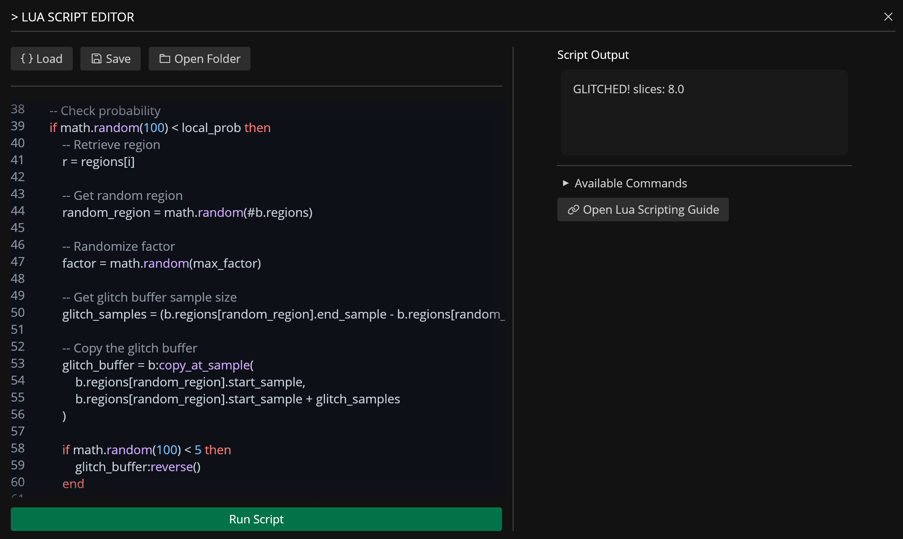

# Lua Editor

---



The Lua Editor lets users extend Recorte functionality through custom Lua scripts (Lua v5.4), that users can edit with the built-in editor or any text editor.

**Lua** is a lightweight, high-performance scripting language designed for embedded systems and extensibility, created and maintained by a dedicated team in PUC-Rio (Brazilian university) and used by many games and applications.  
For more information about Lua, visit [https://www.lua.org/](https://www.lua.org/).

Scripts are stored in the `settings / scripts` folder and can be run via the Lua Editor or custom keyboard shortcuts.

You can access and manipulate [Files](../files.md), [Regions](../regions.md), [Effects](../effects.md), and [Actions](../actions.md) from Lua through custom tables and functions that are available during runtime.

## Scripting


### `action` Table

Global functions that queue actions for the application to process.

| Name / Signature                   | Parameters                    | Functionality                                                            | Return Value       |
|------------------------------------|-------------------------------|--------------------------------------------------------------------------|--------------------|
| `action.open_path(path)`           | `path: string`                | Queues opening of an audio file at the specified filesystem path.        | `void`             |
| `action.activate_file(index)`      | `index: number`               | Switches the active file to the one at the given index (1-based).        | `void`             |
| `action.file_count()`              | *None*                        | Returns the total number of loaded files.                                | `number`           |
| `action.get_file(index)`           | `index: number`               | Retrieves a `File` object at the specified index (1-based).              | `File` (userdata)  |
| `action.update_file(index, file)`  | `index: number`, `file: File` | Replaces the file at the given index with a new `File` object (1-based). | `void`             |
| `action.get_active_file()`         | *None*                        | Returns the currently active `File` object.                              | `File` (userdata)  |
| `action.update_active_file(file)`  | `file: File`                  | Replaces the active file with a new `File` object.                       | `void`             |
| `action.close_file(index)`         | `index: number`               | Queues closing/removing a file at the given index (1-based).             | `void`             |
| `action.close_all_files()`         | *None*                        | Queues closing all loaded files.                                         | `void`             |
| `action.select_next_file()`        | *None*                        | Queues switching to the next file in the list.                           | `void`             |
| `action.select_previous_file()`    | *None*                        | Queues switching to the previous file in the list.                       | `void`             |
| `action.zoom_all()`                | *None*                        | Queues UI zoom to fit the entire waveform.                               | `void`             |
| `action.zoom_selected_region()`    | *None*                        | Queues UI zoom to the currently selected region.                         | `void`             |
| `action.zoom_selection()`          | *None*                        | Queues UI zoom to the current time selection.                            | `void`             |
| `action.export_all_files()`        | *None*                        | Queues export of all loaded files to disk.                               | `void`             |
| `action.debug_table(table)`        | `table: table`                | Debug utility: logs the contents of a Lua table to Recorte's console.    | `void`             |
| `action.available()`               | *None*                        | Lists all available action function names.                               | `string[]` (table) |

### `active_file` Table
Utilities for interacting with the currently active file.

| Name / Signature                       | Parameters               | Functionality                                            | Return Value       |
|----------------------------------------|--------------------------|----------------------------------------------------------|--------------------|
| `active_file.get()`                    | *None*                   | Retrieves the currently active `File` object.            | `File` (userdata)  |
| `active_file.update(file)`             | `file: File`             | Replaces the active file with a new `File` object.       | `void`             |
| `active_file.update_buffer(buffer)`    | `buffer: AudioBuffer`    | Replaces the audio buffer of the active file.            | `void`             |
| `active_file.select_regions(indices)`  | `indices: table<number>` | Selects multiple regions for the active file (1-based).  | `void`             |
| `active_file.selected_regions()`       | *None*                   | Returns the currently selected region indices (1-based). | `table<number>`    |
| `active_file.play()`                   | *None*                   | Queues playback of the active buffer/region.            | `void`             |
| `active_file.close()`                  | *None*                   | Queues closing the currently active file.               | `void`             |
| `active_file.new_files_from_regions()` | *None*                   | Queues creation of new files from all existing regions. | `void`             |
| `active_file.export()`                 | *None*                   | Queues export of the currently active file.             | `void`             |
| `active_file.export_region(index)`     | `index: number` (1-based) | Queues export of the region at the given index of the active file.       | `void`             |
| `active_file.export_selected_regions()`| *None*                   | Queues export of only selected regions.                 | `void`             |
| `active_file.export_all_regions()`     | *None*                   | Queues export of all regions as separate audio files.   | `void`             |
| `active_file.load_effect_preset(path)` | `path: string`           | Loads an effect preset into the active file.             | `void`             |
| `active_file.available()`              | *None*                   | Lists available file utility function names.             | `string[]` (table) |

### Other Globals
| Name / Signature            | Parameters                           | Functionality                                     | Return Value |
|-----------------------------|--------------------------------------|---------------------------------------------------|--------------|
| `info.file_count`           | *Property*                           | Contains the total number of loaded files.        | `number`     |
| `check_equal(list1, list2)` | `list1: string[]`, `list2: string[]` | Utility/debug: adds lengths of two string arrays. | `number`     |

---

### `AudioBuffer` Object
Represents the raw audio data, metadata, and processing methods.

| Name / Signature | Parameters | Functionality | Return Value |
|---|---|---|---|
| `sample_count` | *Field (Read)* | Total number of audio samples in the buffer. | `number` |
| `bpm` | *Field (Read)* | Tempo metadata for the buffer. | `number` |
| `samples` | *Field (Get/Set)* | Raw sample data (multi-channel array). | `table` |
| `sample_rate` | *Field (Read)* | Sample rate in Hz. | `number` |
| `bit_depth` | *Field (Read)* | Audio bit depth (e.g., 16, 24, 32). | `number` |
| `bars` | *Field (Get/Set)* | Number of musical bars in the buffer. | `number` |
| `grid_size` | *Field (Get/Set)* | UI grid snapping size. | `number` |
| `name` | *Field (Get/Set)* | Display name of the buffer. | `string` |
| `regions` | *Field (Get/Set)* | Array of `Region` objects. | `table` |
| `effects` | *Field (Get/Set)* | Serialized global effects applied to the buffer. | `table` (serialized) |
| `size_kb()` | *None* | Calculates memory size of the buffer. | `number` (KB) |
| `is_mono()` | *None* | Checks if buffer has 1 channel. | `boolean` |
| `is_stereo()` | *None* | Checks if buffer has 2 channels. | `boolean` |
| `length_ms()` | *None* | Calculates duration in milliseconds. | `number` |
| `channel_diff()` | *None* | Computes difference between channels. | `table` |
| `restore()` | *None* | Reverts buffer to its original reference samples. | `void` |
| `resample(new_rate)` | `new_rate: number` | Resamples audio to a new sample rate. | `void` |
| `add_region(start, end)` | `start: number`, `end: number` | Adds a region at sample positions. | `void` |
| `remove_region(index)` | `index: number` (1-based) | Removes a region by index. | `void` |
| `region_count()` | *None* | Returns number of regions. | `number` |
| `get_region_info(index)` | `index: number` (1-based) | Returns metadata for a region. | `RegionInfo` |
| `remove_all_regions()` | *None* | Clears all regions. | `void` |
| `detect_regions(threshold, min_length_ms)` | `threshold: number`, `min_length_ms: number` | Auto-detects regions based on loudness threshold and minimum length. | `table<Region>` |
| `detect_transients(threshold)` | `threshold: number` | Marks transient points for snapping. | `void` |
| `get_region(index)` | `index: number` (1-based) | Returns a `Region` object. | `Region` |
| `join_all_regions(sep_ms)` | `sep_ms: number` | Concatenates all regions with separation silence. | `AudioBuffer` |
| `auto_trim_region(idx, thresh)` | `idx: number`, `thresh: number` | Shrinks region edges below threshold. | `void` |
| `zero_cross_region(index)` | `index: number` (1-based) | Snaps region edges to zero-crossings. | `void` |
| `zero_cross_transients()` | *None* | Snaps transient markers to zero-crossings. | `void` |
| `slice(slices)` | `slices: number` | Divides entire buffer into N equal regions. | `void` |
| `slice_region(idx, slices)` | `idx: number`, `slices: number` | Divides a specific region into N equal parts. | `void` |
| `copy_at_sample(start, end)` | `start: number`, `end: number` | Copies samples to a new buffer. | `AudioBuffer` |
| `copy_at_position(start, end)` | `start: 0.0-1.0`, `end: 0.0-1.0` | Copies proportional section to new buffer. | `AudioBuffer` |
| `cut_at_sample(start, end)` | `start: number`, `end: number` | Cuts samples, returns cut section. | `AudioBuffer` |
| `cut_at_position(start, end)` | `start: 0.0-1.0`, `end: 0.0-1.0` | Cuts proportional section, returns cut. | `AudioBuffer` |
| `paste_at_sample(buf, idx, repl)` | `buf: AudioBuffer`, `idx: number`, `repl: boolean` | Pastes buffer at sample index (insert/replace). | `void` |
| `paste_at_position(buf, pos, repl)` | `buf: AudioBuffer`, `pos: 0.0-1.0`, `repl: boolean` | Pastes buffer at proportional position. | `void` |
| `mix_at_sample(buf, pos, mix)` | `buf: AudioBuffer`, `pos: number`, `mix: number` | Mixes buffer into target at sample position. | `void` |
| `mix_at_position(buf, pos, mix)` | `buf: AudioBuffer`, `pos: 0.0-1.0`, `mix: number` | Mixes buffer at proportional position. | `void` |
| `update_region(idx, region)` | `idx: number`, `region: Region` | Overwrites an existing region. | `void` |
| `export_region(index)` | `index: number` (1-based) | Exports region as a new independent buffer. | `AudioBuffer` |
| `normalize(value)` | `value: number` | Applies normalization. | `void` |
| `fade_in(duration)` | `duration: number` | Applies fade-in envelope. | `void` |
| `fade_out(duration)` | `duration: number` | Applies fade-out envelope. | `void` |
| `gain(value)` | `value: number` | Applies gain adjustment (linear). | `void` |
| `rate(value)` | `value: number` (multiplier) | Changes playback rate/time-stretch. | `void` |
| `reverse()` | *None* | Reverses audio samples. | `void` |
| `pitch(amount)` | `amount: number` (semitones) | Pitch-shifts audio. | `void` |
| `pitch_shift(amount)` | `amount: number` (semitones) | Pitch-shifts audio with formant preservation. | `void` |
| `size()` | *None* | Returns the formatted size of the buffer as a string. | `string` |
| `channel()` | *None* | Returns the number of channels. | `number` |
| `remove_channel(index)` | `index: number` (1-based) | Removes a channel by index. | `void` |
| `trim_to_regions(indices)` | `indices: table<number>` (1-based) | Trims the buffer to the specified regions. | `void` |

* Methods ending in `_at_position` accept `0.0` (start) to `1.0` (end). Values are automatically clamped.

---

### `Region` Object
Represents a defined slice/segment of an audio buffer.

| Name / Signature | Parameters        | Functionality                                | Return Value |
|------------------|-------------------|----------------------------------------------|--------------|
| `name`           | *Field (Get/Set)* | Display name of the region.                  | `string`     |
| `start_sample`   | *Field (Get/Set)* | Start position in samples.                   | `number`     |
| `end_sample`     | *Field (Get/Set)* | End position in samples.                     | `number`     |
| `length`         | *Field (Read)*    | Calculated sample length (`end - start`).    | `number`     |
| `pitch_str`      | *Field (Read)*    | String representation of the region's pitch. | `string`     |
| `bpm`            | *Field (Get/Set)* | Tempo metadata specific to the region.       | `number`     |

---

### `RegionInfo` Object
Read-only metadata returned by `AudioBuffer:get_region_info()`.

| Name / Signature | Parameters     | Functionality                      | Return Value |
|------------------|----------------|------------------------------------|--------------|
| `index`          | *Field (Read)* | Zero-based index of the region.    | `number`     |
| `name`           | *Field (Read)* | Region name.                       | `string`     |
| `start_sample`   | *Field (Read)* | Absolute start in samples.         | `number`     |
| `end_sample`     | *Field (Read)* | Absolute end in samples.           | `number`     |
| `start_rel`      | *Field (Read)* | Relative start position (0.0-1.0). | `number`     |
| `end_rel`        | *Field (Read)* | Relative end position (0.0-1.0).   | `number`     |
| `length_ms`      | *Field (Read)* | Duration in milliseconds.          | `number`     |

---

### `File` Object
Represents a loaded audio file in the workspace.

| Name / Signature | Parameters        | Functionality                        | Return Value  |
|------------------|-------------------|--------------------------------------|---------------|
| `path`           | *Field (Get/Set)* | Filesystem path of the loaded file.  | `string`      |
| `buffer`         | *Field (Get/Set)* | The underlying `AudioBuffer` object. | `AudioBuffer` |

---

### `Effect` Object
Internal effect representation (typically handled through the `effects` field).

| Name / Signature | Parameters     | Functionality                               | Return Value |
|------------------|----------------|---------------------------------------------|--------------|
| `name`           | *Field (Read)* | Auto-formatted string name of the effect. | `string`     |

---

### Important Scripting Notes

-  **1-Based Indexing**: All Lua functions referencing `index` for regions or files use **1-based indexing**. Passing `0` throws a runtime error in most methods; `action.close_file(0)` and `active_file.export_region(0)` treat `0` as `1`. Out-of-range indices on queued actions are silently ignored. Methods returning `RegionInfo` (like `AudioBuffer:get_region_info()`) use 0-based indexing for the `index` field.


- **Asynchronous Actions**: All `action.*` functions do **not** execute immediately. They push commands to an internal action queue that the UI/app processes on the next tick.

-  **In-Place vs Copy**: Methods like `normalize`, `fade_in`, `pitch`, and `slice` modify the `AudioBuffer` **in-place** and return `void`. Methods like `copy_at_...`, `cut_at_...`, and `join_all_regions` return **new** `AudioBuffer` instances without altering the source.

- **Serialization**: The `effects` field expects/returns a Lua table that serializes to JSON matching the Rust `Effect` structure.

- **Object Copying**: When you retrieve an `AudioBuffer` or `File` object (for example, `action.get_active_file()`), you get a clone/snapshot. Modifications to this Lua object do not affect the application state. You must use an `update_` function to apply changes (for example, `action.update_active_file()` or `active_file.update_buffer()`).

- **`Effect` Creation**: To set the `effects` field, provide a Lua table of effect slots matching the Rust `EffectSlot` structure: each slot has a `status` boolean and an `effect` entry keyed by the `Effect` variant name (externally tagged). Examples:

```lua
b.effects = {
    { status = true, effect = { Gain = -6.0 } },
    { status = true, effect = { Normalize = 0.9 } },
    { status = true, effect = { PitchShift = { window = 50, amount = 2.0, oversampling = 16 } } },
}
```

