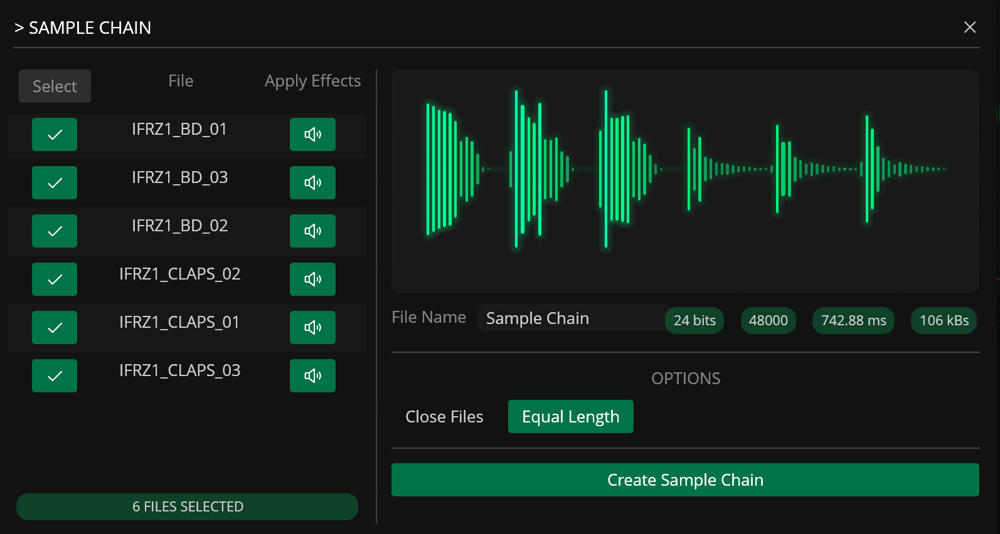

# Sample Chain

---

The Sample Chain tool joins multiple audio files into a single file, reducing file count and facilitating workflows with hardware instruments such as the Elektron Octatrack, Teenage Engineering OP1, Dirtywave M8, and the Polyend Tracker.

When chaining multiple files, the tool uses the lowest sample rate and bit depth of the selected files and automatically converts all files to those settings.

|  Option | Description |
|----------|-------------|
| Close Source Files | Closes all selected files after the new file is created |
| Equal Length | Automatically matches the length of all files by padding the end |
