# Editor

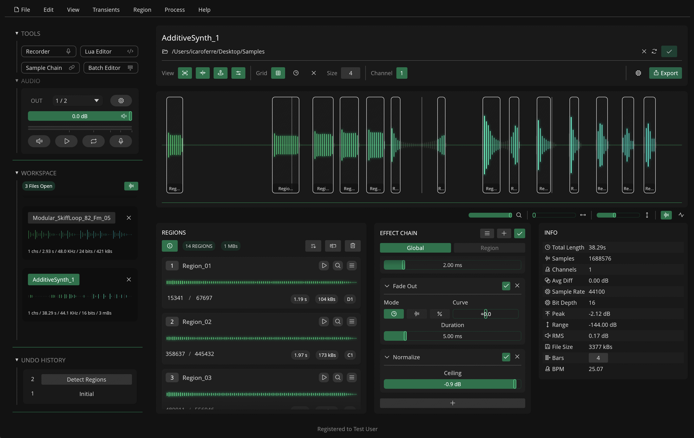

---

## Sidebar

The left sidebar on the user interface contains different sub-sections.

---

### Tools

{width="300", .float-right }

This sub-section contains a list of the available tools in Recorte.

Each tool adds extra functionality to the editor to create, edit and interact with files available in the workspace.

Available tools (*click on tool name for more information*):

- **`Recorder`**
- **`Lua Editor`**
- **`Sample Chain`**
- **`Batch Editor`**

---

### Audio

{width="300", .float-right }

The audio sub-section contains different controls for the audio engine, including:

- Output Channel drop-down selector
- Button to open Recorte's settings (:phosphor-gear:)
- Slider for output / preview volume
- Level meter showing the current output level
- Buttons for enabling audio output (:phosphor-speaker-high:), playing / stopping playback (:phosphor-play: / :phosphor-stop:), toggling looping (:phosphor-repeat:) and enabling audio input (:phosphor-microphone:).

!!! info
    Output volume and looping are not stored across sessions and are set to default when the application is open.

---

### Workspace

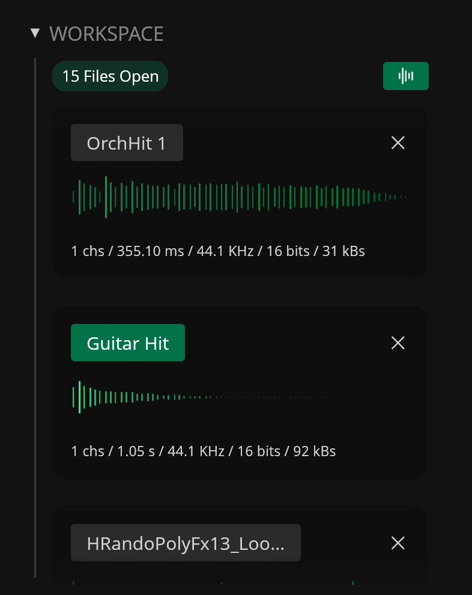{width="300", .float-right }

The workspace sub-section contains the list of files currently open in your workspace. A badge shows how many files are currently open.

Each file shows a header with its name, a close button (:phosphor-x:), a waveform preview, and file information (channels, length, sample rate, bit depth, and size).

The waveform previews can be hidden through the waveform button (:phosphor-waveform:) to compact the file list. 

---

### Undo History

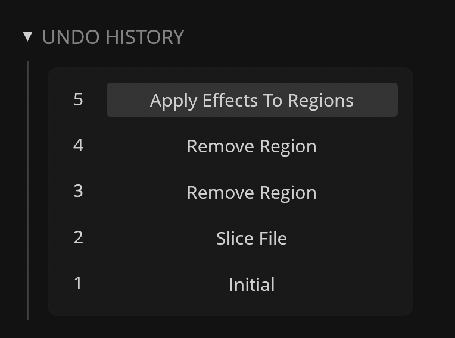{width="300", .float-right }

The undo history sub-section contains a list of undoable changes made to the currently active file. 

Click an item in the list to revert to the selected state.

---

### Clipboard

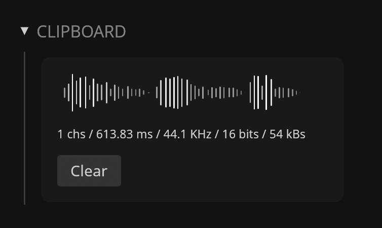{width="300", .float-right }

The clipboard sub-section displays the content of the workspace clipboard when any audio is copied to it (using the `Copy` command).

It shows a waveform preview, file information (channels, length, sample rate, bit depth, and size), and a **Clear** button to empty the clipboard. When there is no content, it shows an "Empty Clipboard" placeholder.

---

## Editor Panel

The main content panel contains the parameters available for the active file.

### File Header

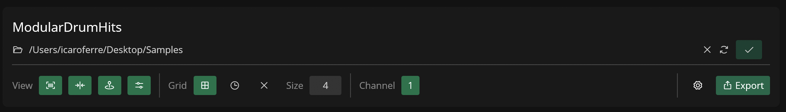{ .float-right }

The file header is divided into 3 separate rows:

- **File name**: text field to display and edit the file name (click to edit)

- **File path / folder**: path for export (click on :phosphor-folder-open: to reveal, :phosphor-arrows-clockwise: to change, or :phosphor-x: to clear). A status indicator shows a check (:phosphor-check:) when the file is saved, or a warning (:phosphor-warning:) with an export option when it contains unsaved changes

- **View Options / Export**: toggles and controls for the waveform display, grid, channel and export (see table below)

| Name    | Icon |  Description                                                 |
|---------|---| ----------------------------------------------------------|
| **View** | - | - |
| Regions | :phosphor-barcode: | Toggle the visibility of regions in the waveform display |
| Transients | :phosphor-arrows-in-line-horizontal: | Toggle the visibility of transients in the waveform display |
| Position | :phosphor-map-pin-simple-area: | Toggle the visibility of the viewport position guide |
| Waveform Parameters | :phosphor-sliders-horizontal: | Toggle the visibility of waveform display parameters |
| **Grid** |-  | - |
| Enable Grid        | :phosphor-grid-four:         | Enable the waveform grid           |
| Grid Size          | -                            | Set the grid size (1–256)          |
| Enable Timelines   | :phosphor-clock:             | Enable time markers                |
| Disable Grid       | :phosphor-x:                 | Disable Grid / Time                |
| **Channel** | - | - |
| Channel Focus      | -                            | Select the channel shown in the waveform display (All + per-channel for multichannel files) |
| **Export** | - |-  |
| Export Settings | :phosphor-gear: | Open export settings |
| Export | :phosphor-export: | Open export menu (Export Selected Region, Export All Regions, Export File, Export File As) |

---

### Waveform Display

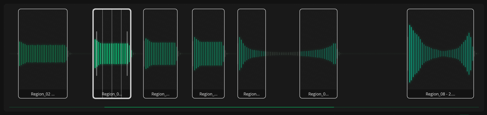

The waveform display works as an interactive display of the currently active file.

It displays the waveform (using one of the available [Waveform Parameters](#waveform-parameters) modes), regions, transients and the background grid. When interacted with a mouse, it can make selections, create and manipulate regions, and set the playback position.

#### Create / Edit Regions

[Regions](regions.md) can be created and edited through the Waveform display.

To create a region, click and drag on the waveform to create a selection. Then click the selection to create a new region.

To move the region, click and drag on an existing region. Drag the left or right edge of a region bound to adjust its start or end point.

To edit multiple regions simultaneously, hold **Command** (macOS) or **Control** to select them. Release the key, then click and drag to edit.

#### Mouse Interactions

| Action                    | Target    | Result                                       |
|---------------------------|-----------|----------------------------------------------|
| Click                     | Waveform  | Set / Cancel Playback Position               |
| Click and Drag            | Waveform  | Create Selection                             |
| Mouse Scroll (horizontal) | Waveform  | Scroll horizontally                          |
| Mouse Scroll (vertical)   | Waveform  | Adjust Zoom                                  |
| Shift + Click             | Waveform  | Move the end of an existing selection        |
| Command/Ctrl + Drag       | Waveform  | Scroll horizontally / zoom vertically (hold Shift for fine control) |
| Click                     | Selection | Create Region                                |
| Click                     | Region    | Select Region                                |
| Command/Ctrl + Click      | Region    | Add / Remove Region to Selection             |
| Click and Drag            | Region    | Move / Resize Selected Region                |
| Shift + Click and Drag    | Region    | Move / Resize Selected Region (Fine Control) |
| Right-Click               | Any       | Open Contextual Menu                         |

---

### Waveform Parameters

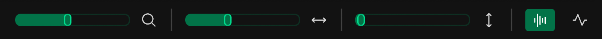

The Waveform Parameters section contains different parameters to control the Waveform Display.

| Parameter | Icon                         | Description                        |
|--------------------|------------------------------|------------------------------------|
| Zoom               | :phosphor-magnifying-glass:  | Set horizontal zoom                |
| Position           | :phosphor-arrows-horizontal: | Set the horizontal scroll position |
| Vertical Zoom      | :phosphor-arrows-vertical:   | Set the vertical zoom              |
| Bar Waveform Mode  | :phosphor-waveform:          | Set Waveform Display mode to Bars  |
| Line Waveform Mode | :phosphor-pulse:             | Set Waveform Display mode to Lines |

---

### Regions

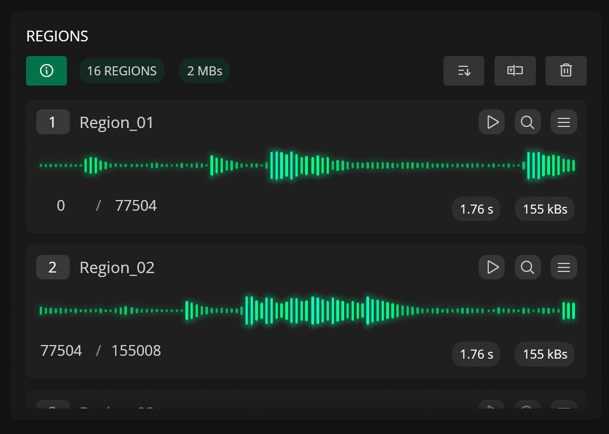{ .float-right, width="400" }

The Regions panel contains a scrolling list of the regions in the active file. Badges show the total number of regions and their combined size. The panel also includes options to sort, rename, and remove regions.

#### Buttons

| Header Button             | Description                     |
|---------------------------|---------------------------------|
| :phosphor-info:           | Toggle Region Info / Parameters |
| :phosphor-sort-ascending: | Sort regions (by name, length, start or end position) |
| :phosphor-textbox:        | Rename Regions                  |
| :phosphor-trash:          | Remove selected or all regions  |

#### Regions List

The top section of each region contains a number button. Click it to select the region. A text input shows and edits the region name. Buttons let you play, zoom to, and show options for the region.

Each region also contains a waveform display. Click it to add or remove a region from the current selection.

When Region Info is enabled (:phosphor-info:), each region row also shows the start and end sample values (drag to adjust) and badges with the region length, size, and detected pitch.

| Button                      | Description         |
|-----------------------------|---------------------|
| :phosphor-play:             | Play Region         |
| :phosphor-magnifying-glass: | Zoom to Region      |
| :phosphor-list:             | Show Region Options |

The Region Options sub-menu also includes options to delete and export the region.

---

### Effect Chain

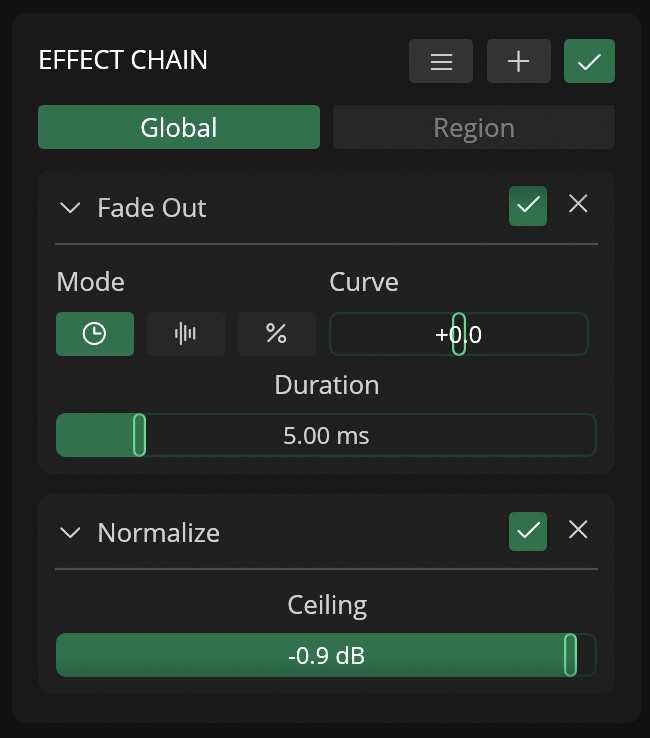{width="400" }

The Effect Chain panel is used to add, remove, and re-order effects in the Global and Region effect chain.

For more information about Effects and Effect Chains, check out the **[Effects](effects.md)** section.

#### Buttons

| Button           | Description                    |
|------------------|--------------------------------|
| :phosphor-list:  | Show Effect Chain Options      |
| :phosphor-plus:  | Add effect to selected chain   |
| :phosphor-check: | Enable / Disable effect chains |

#### Effect list

Use the tab buttons to switch between the **Global** and **Region** effect chains.

The effect list shows all effects in the selected chain. It includes the effect name, parameters, and buttons to collapse, enable or disable, and remove each effect.

Effects can be re-ordered in the chain through drag-and-drop.

!!! note
    The Region Effect Chain is independent per-region. When set to `Region`, the Effect Chain shows the list of effects for the last selected region.

#### Effect Chain Presets

Individual effect chains can also be saved as presets (JSON format) and loaded into the **Global** or **Region** chains.

When opening or recording a new file, Recorte automatically loads the `default` preset to the `Global` effect chain.

#### Effect Chain Options

| Option | Description                    |
|------------------|--------------------------------|
| Apply to Selection  | Applies the effect chains to the current waveform selection (destructively) |
| Apply to Selected Regions  | Applies the effect chains to selected regions (destructively) |
| Apply to All Regions  | Applies the effect chains to all regions (destructively) |
| Apply to File  | Applies the effect chains to the entire file (destructively) |
| Copy | Copies the selected effect chain to the clipboard |
| Paste | Pastes from the clipboard to the selected chain |
| Clear | Clears the effect chain |
| Oversample | Sets the oversampling factor for the effect chains |
| Presets | Save, save as default, or load effect chain presets; open the presets folder |

---

### Info

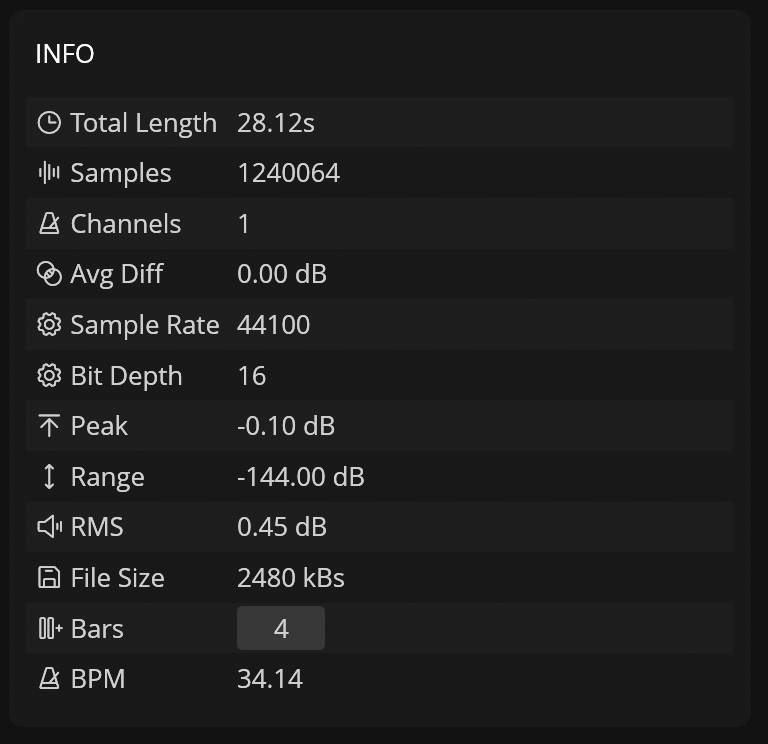{  width="400" }

The Info panel contains an information table for the active file.

| Info         | Description                                 |
|--------------|---------------------------------------------|
| Total Length | Length of the file                          |
| Samples      | Number of samples                           |
| Channels     | Number of channels                          |
| Avg Diff     | Difference between channels (dB)            |
| Sample Rate  | Sample Rate of the file                     |
| Bit Depth    | Bit-depth of the file                       |
| Peak         | Max sample value (dB)                       |
| Range        | Dynamic Range (dB)                          |
| RMS          | Average RMS of the file                     |
| File Size    | File size in kilobytes                      |
| Bars         | Number of bars (editable, used for BPM calculation) |
| BPM          | Calculated BPM based on sample count x bars |

---

## Export Settings

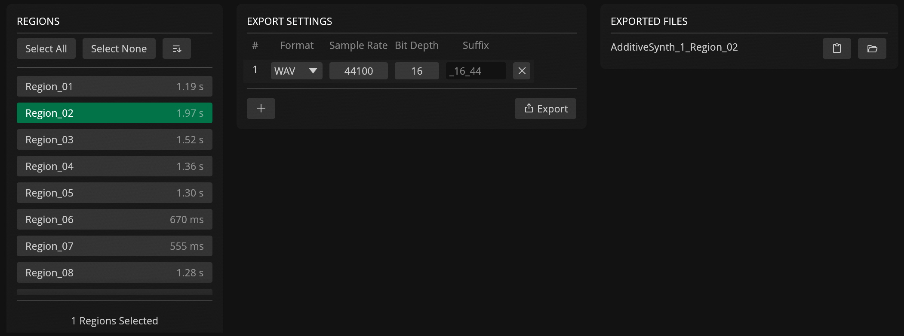

Open the Export Settings modal by clicking the export settings button (:phosphor-gear:). It provides a three-panel interface to configure export options and manage exported files:

### Regions Panel (Left)

The left panel displays all regions available in the active file with options to select, sort, and preview them.

| Control | Description |
|---------|-------------|
| **Select All** | Select every region in the list |
| **Select None** | Deselect all regions |
| **Sort Menu** | Sort regions by name, length, start position, or end position |
| Region List | Click to select/deselect; hover for waveform preview tooltip |

The selected regions determine which audio will be exported when an export action is triggered.

### Export Settings Panel (Center)

The center panel contains a table where each row defines one export configuration with the following columns:

| Column | Control | Description |
|--------|---------|-------------|
| **#** | Auto-numbered | Row index |
| **Format** | Drop-down selector | Choose between **WAV** and **AIFF** |
| **Sample Rate** | Drag value input | Set sample rate from 1 to 192,000 Hz |
| **Bit Depth** | Drag value input | Set bit depth from 1 to 24 bits |
| **Suffix** | Text input | File name suffix appended before the extension (default hint: `_{bitDepth}_{sampleRate/1000}`) |

Each row can be removed individually using the remove button (:phosphor-x:) on the right.

Below the table, two action buttons are available:

| Button | Description |
|--------|-------------|
| **:phosphor-plus:** | Add a new export configuration row (defaults to active file's sample rate, bit depth, and channel count) |
| **:phosphor-export: Export** | Open export options menu |

The export menu provides three actions:

| Option | Description |
|--------|-------------|
| **Export Selected Region** | Export only the currently selected region using all configured settings |
| **Export All Regions** | Export every region in the file using all configured settings |
| **Export File** | Export the entire active file (without regions) using all configured settings |

### Exported Files Panel (Right)

The right panel lists all files exported during the current session, displayed in reverse chronological order (most recent first).

Each row shows:

- **File name** (without extension)
- **:phosphor-clipboard:** — Copy the full file path to the clipboard
- **:phosphor-folder-open:** — Reveal the file in the system's file manager

